# Домашнее задание к занятию "`Работа с данными (DDL/DML)`" - `Рахманов Александр`


### Инструкция по выполнению домашнего задания

   1. Сделайте `fork` данного репозитория к себе в Github и переименуйте его по названию или номеру занятия, например, https://github.com/имя-вашего-репозитория/git-hw или  https://github.com/имя-вашего-репозитория/7-1-ansible-hw).
   2. Выполните клонирование данного репозитория к себе на ПК с помощью команды `git clone`.
   3. Выполните домашнее задание и заполните у себя локально этот файл README.md:
      - впишите вверху название занятия и вашу фамилию и имя
      - в каждом задании добавьте решение в требуемом виде (текст/код/скриншоты/ссылка)
      - для корректного добавления скриншотов воспользуйтесь [инструкцией "Как вставить скриншот в шаблон с решением](https://github.com/netology-code/sys-pattern-homework/blob/main/screen-instruction.md)
      - при оформлении используйте возможности языка разметки md (коротко об этом можно посмотреть в [инструкции  по MarkDown](https://github.com/netology-code/sys-pattern-homework/blob/main/md-instruction.md))
   4. После завершения работы над домашним заданием сделайте коммит (`git commit -m "comment"`) и отправьте его на Github (`git push origin`);
   5. Для проверки домашнего задания преподавателем в личном кабинете прикрепите и отправьте ссылку на решение в виде md-файла в вашем Github.
   6. Любые вопросы по выполнению заданий спрашивайте в чате учебной группы и/или в разделе “Вопросы по заданию” в личном кабинете.
   
Желаем успехов в выполнении домашнего задания!
   
### Дополнительные материалы, которые могут быть полезны для выполнения задания

1. [Руководство по оформлению Markdown файлов](https://gist.github.com/Jekins/2bf2d0638163f1294637#Code)

---

### Задание 1

### Решение

1. Поднимите чистый инстанс MySQL версии 8.0+. Можно использовать локальный сервер или контейнер Docker.

```
wget -c https://dev.mysql.com/get/mysql-apt-config_0.8.36-1_all.deb
sudo dpkg -i mysql-apt-config_0.8.36-1_all.deb
sudo apt update
sudo apt install mysql-server
sudo systemctl status mysql
sudo systemctl enable mysql
mysql -u root -p
```

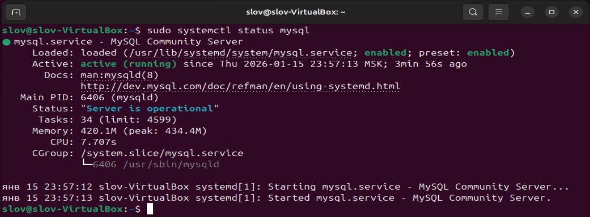
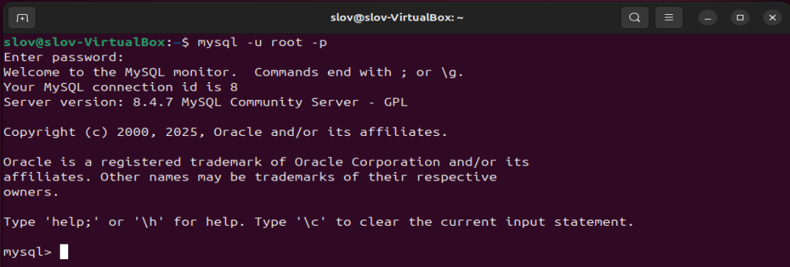

2. Создайте учётную запись sys_temp.

```
CREATE USER 'sys_temp'@'localhost' IDENTIFIED BY '123456';
```

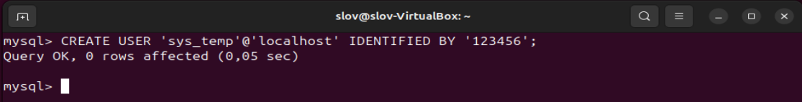

3. Выполните запрос на получение списка пользователей в базе данных. (скриншот)

```
SELECT user FROM mysql.user;
```

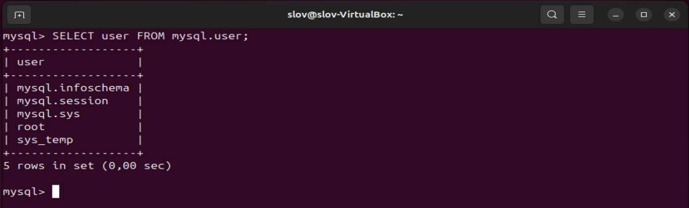

4. Дайте все права для пользователя sys_temp.

```
GRANT ALL PRIVILEGES ON *.* TO 'sys_temp'@'localhost' WITH GRANT OPTION;
```

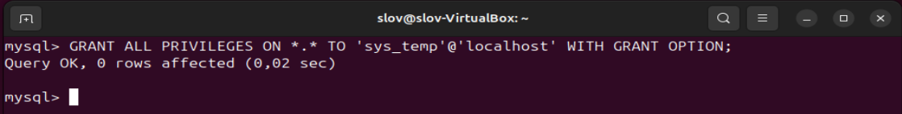

5. Выполните запрос на получение списка прав для пользователя sys_temp. (скриншот)

```
SELECT * FROM information_schema.user_privileges WHERE GRANTEE="'sys_temp'@'localhost'";
```

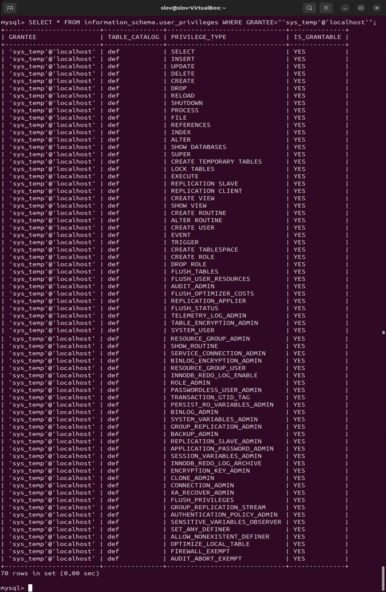


6. Переподключитесь к базе данных от имени sys_temp.

```
SYSTEM mysql -u sys_temp -p
SELECT user();
```

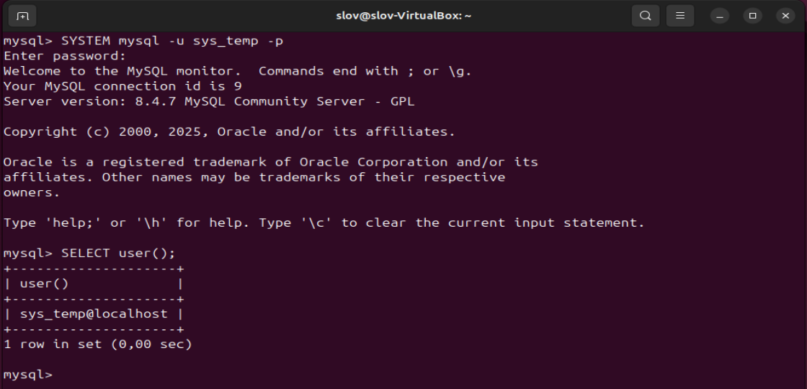

7. По ссылке https://downloads.mysql.com/docs/sakila-db.zip скачайте дамп базы данных.

```
wget https://downloads.mysql.com/docs/sakila-db.zip
unzip sakila-db.zip
ls
```

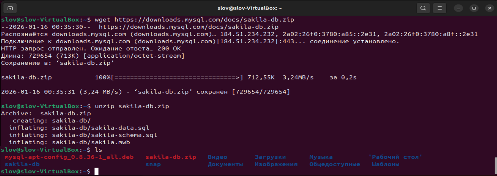

8. Восстановите дамп в базу данных.

```
source /home/slov/sakila-db/sakila-schema.sql
source /home/slov/sakila-db/sakila-data.sql
SHOW DATABASES;
```

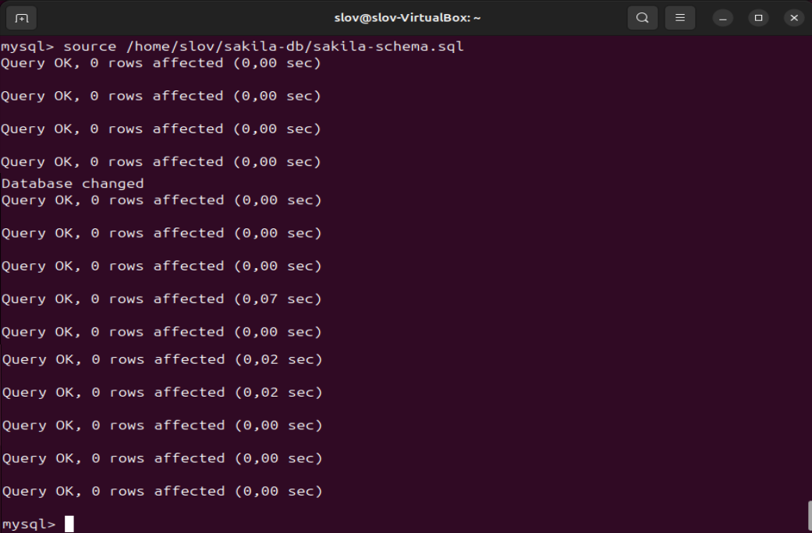

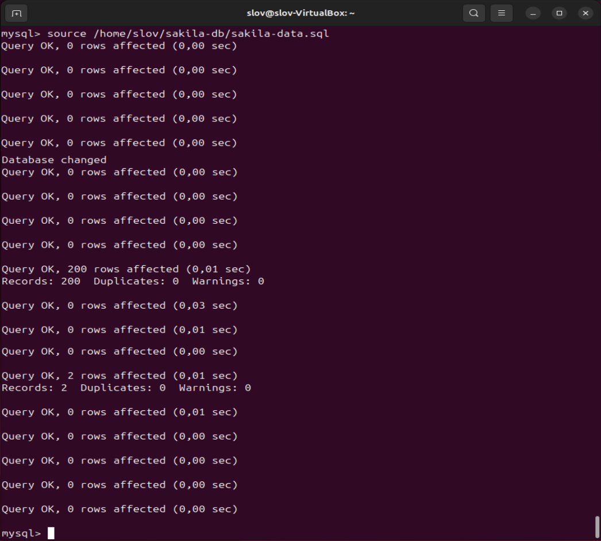

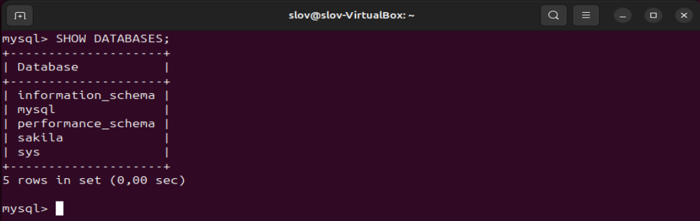


9. При работе в IDE сформируйте ER-диаграмму получившейся базы данных. При работе в командной строке используйте команду для получения всех таблиц базы данных. (скриншот)

```
SHOW TABLES;
```

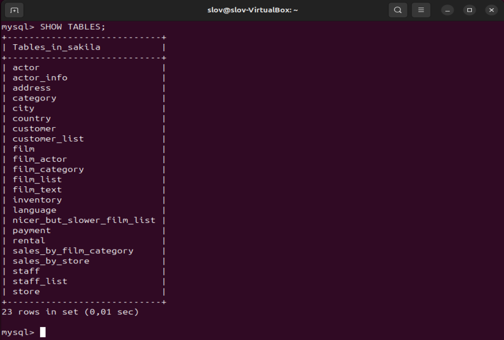

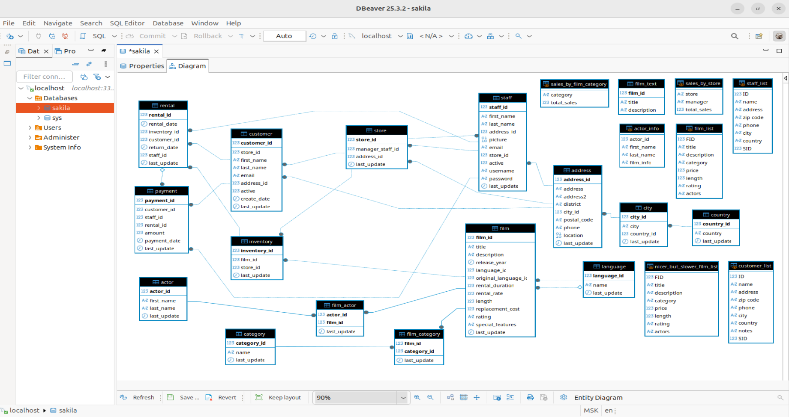

---

### Задание 2

Составьте таблицу, используя любой текстовый редактор или Excel, в которой должно быть два столбца: в первом должны быть названия таблиц восстановленной базы, во втором названия первичных ключей этих таблиц. Пример: (скриншот/текст)

```
SELECT TABLE_NAME, COLUMN_NAME FROM INFORMATION_SCHEMA.key_column_usage WHERE table_schema = 'sakila' AND CONSTRAINT_NAME = 'PRIMARY';
```

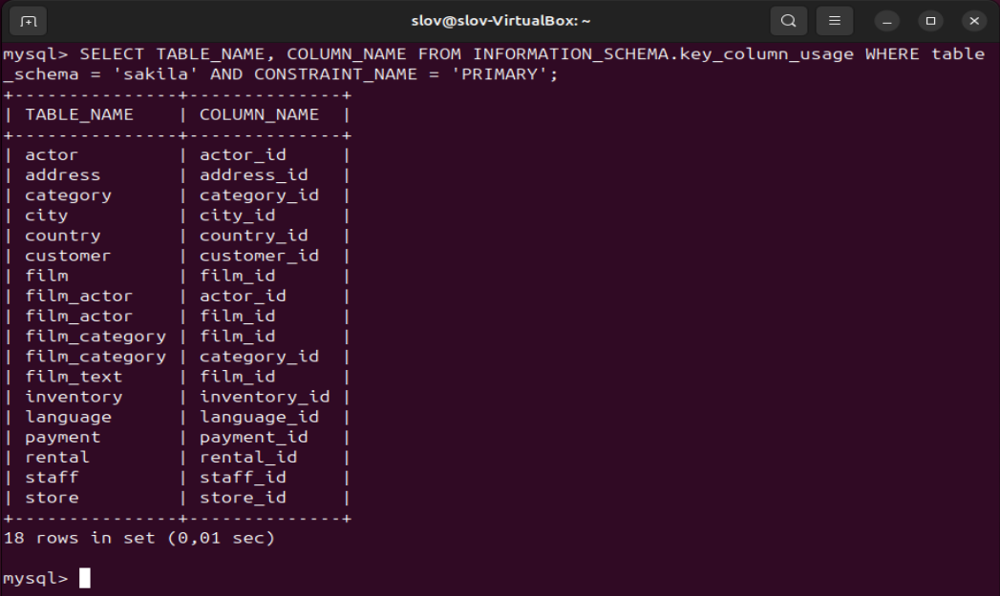

```
+---------------+--------------+
| TABLE_NAME    | COLUMN_NAME  |
+---------------+--------------+
| actor         | actor_id     |
| address       | address_id   |
| category      | category_id  |
| city          | city_id      |
| country       | country_id   |
| customer      | customer_id  |
| film          | film_id      |
| film_actor    | actor_id     |
| film_actor    | film_id      |
| film_category | film_id      |
| film_category | category_id  |
| film_text     | film_id      |
| inventory     | inventory_id |
| language      | language_id  |
| payment       | payment_id   |
| rental        | rental_id    |
| staff         | staff_id     |
| store         | store_id     |
+---------------+--------------+
```

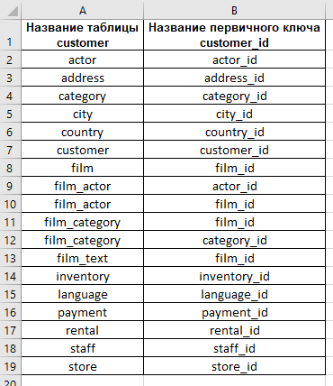

---
